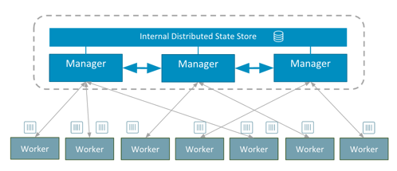

Here, we will cover [Docker Compose](https://github.com/docker/compose), 
[Docker Swarm](https://github.com/docker/swarm), and 
[Kubernetes](https://github.com/kubernetes/kubernetes).                         
                                                                                
Before we dive in, let's start with some background.
This guide focuses on how to use containers to deploy applications.             

## Why containers?

Some of the benefits of using containers is that applications become more 
portable - no more "I don't know what wrong, it works on my machine," 
for the most part. 
Containers allow us to bundle all software and system dependencies together 
thus eliminating a lot of unwanted interactions and requirements from 
third-party software that may be installed in a machine during the development
process.                                                                        

Another benefit is scalability.
Imagine we have a web application, a blogging site let's say.
Our web application will make use of some database to store user information. 

The simplest way to deploy our site and make it available to the internet is by 
getting our hands on a virtual machine (VM), opening up the VM to HTTP(S) 
traffic and running the web app container and the database container on the VM. 

At first, or site may not be very popular. We may only manage to get a couple
friends to try it out. 
But, hopefully, with enough time, millions and millions of people will come to 
use our site. 

By using containers, scaling becomes as easy as replicating the web server - 
each replica handles some of the incoming traffic. 
Using containers simplifies this process. 

Since containers minimize the interaction between an application and the host 
machine, it becomes possible for administrators to maximize resource utilization
by moving hungry containers to idle machines and/or capping their resources for 
maximum service availability.

## Docker compose

> Compose is a tool for defining and running multi-container Docker
> applications. 
[Docker compose documentation](https://docs.docker.com/compose/)

Compose allows us to orchestrate containers within a single host machine.

Going back to our sample blogging site, we can write a compose manifest 
(a yaml file) which will deploy an instance of a web server, a web app, and a
database.

Instead of doing all the work manually, we can use compose's declarative syntax
to specify the state of our application and of all the services that make it
up.

Compose gives you control over:
* Image build
* Conatiner execution
* Networks
* Volumes
* Healthchecks
* Logging
* Configuration
* Capabilities (`man 7 capabilities`)
* Control over resources
* Deployments (swarm)
* Service discovery (swarm)

For a more details, see 
[compose file reference](https://docs.docker.com/compose/compose-file/)

### Resources

* [docker/app](https://github.com/docker/app) Make your Docker Compose 
  applications reusable, and share them on Docker Hub

## Docker swarm

**A native clustering system for Docker**

> It turns a pool of Docker hosts into a single, virtual host using an API
> proxy system.

### Resources

* [Swarm tutorial](https://docs.docker.com/get-started/part3/)

## Kubernetes

The "operating system" of cloud computing!

### Resources

* [Scalable microservices with kubernetes](https://www.udacity.com/course/scalable-microservices-with-kubernetes--ud615)

* [Kubernetes up and running](http://shop.oreilly.com/product/0636920043874.do)

## Even more resources

* [Principles of chaos engineering](https://principlesofchaos.org/)

* [katacoda](https://www.katacoda.com/)

* [Isio](https://istio.io/docs/concepts/what-is-istio/)
